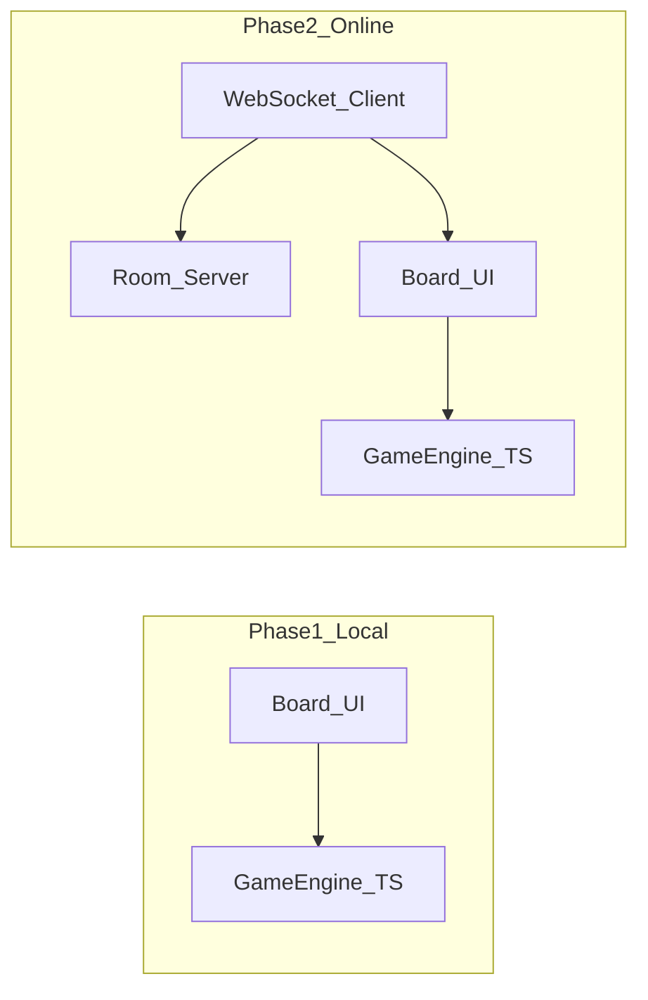

# 五子棋 Web 对弈网站 — 实施规划

## 目标拆分

| 阶段      | 交付物                       |
| ------- | ------------------------- |
| **MVP** | 浏览器内本地黑白双方轮流落子、胜负判定、新局/重置 |
| **扩展**  | 房间或匹配、实时同步落子、基础断线/重连策略    |

---

## 一、技术选型（建议）

- **前端**： [Vite](https://vitejs.dev/) + **TypeScript** + 任选 UI 框架（React / Vue / Svelte）或纯 DOM；五子棋状态简单，**Vanilla TS + 组件化模块**也足够，若你更熟悉 React 可统一用 React。
- **样式**：CSS Modules 或 Tailwind（二选一即可），保证棋盘在不同屏幕下可用（触摸友好、格子足够大）。
- **联网阶段**：Node.js + **WebSocket**（如 `ws` 或 Socket.IO）做房间与步数广播；或 BaaS（Supabase Realtime / Firebase）减少自建服务器成本。

核心原则：**胜负与落子规则放在与 UI 无关的纯 TS 模块**，本地与联网共用同一套 `game` 包逻辑，联网只多一层「通过网络应用对方步」。

---

## 二、第一阶段：本地双人对弈（必做清单）

### 1. 项目脚手架

- `npm create vite@latest`（TypeScript 模板），配置路径别名、ESLint/Prettier（可选）。
- 目录建议：`src/game/`（规则引擎）、`src/ui/`（棋盘与页面）、`src/types/`（Board、Move、Player 等）。

### 2. 游戏规则引擎（无 UI）

- **棋盘**：常见 **15×15**；用一维或二维数组表示空/黑/白。
- **落子**：仅允许在空位落子；维护当前行棋方（黑先可遵循习惯）。
- **胜负**：横、竖、两斜四个方向，任一方连续 **5 子** 即胜（明确是否要求「恰好五连」还是「五子及以上」——一般实现为 `>= 5` 即可）。
- **和棋**（可选）：全盘填满且无胜方。
- **API 示例**（概念）：`createGame()`、`applyMove(x, y)` → `{ ok, reason?, winner?, board }`、`getLegalMoves()`（若不做禁手可省略复杂规则）。

> **说明**：标准竞技五子棋有禁手（黑方三三、四四、长连等）。若只做休闲对弈，**第一版可不做禁手**；若要做「规则完整」，需单独列任务实现禁手检测。

### 3. 前端交互与界面

- 绘制棋盘网格与「星位」；点击交叉点落子（或点击最近格心）。
- 显示当前执子方；落子后切换；游戏结束后禁止继续落子并展示胜负文案。
- **新局**按钮；可选 **悔棋**（需双方同意或简单「退一步」策略）。

### 4. 质量与体验

- 基础无障碍：按钮可键盘操作、关键状态有文字说明（不仅靠颜色区分黑白）。
- 简单响应式：窄屏缩小棋盘或允许横向滚动，避免误触。

### 5. 部署（可选但推荐）

- 静态托管：Vercel / Netlify / GitHub Pages，与 `vite build` 输出对接。

---

## 三、第二阶段：联网对弈（在引擎稳定后做）

### 1. 服务端

- 提供 **创建房间 / 加入房间**（房间号或链接）；校验同一房间仅两名玩家（或观战位若以后要做）。
- **消息协议**（建议 JSON）：`JOIN`、`MOVE {x,y,player}`、`STATE_SYNC`、`GAME_OVER`、`ERROR`、`PING/PONG`。
- 服务端保存：`roomId → { board 或 move 列表, 当前行棋方, 状态 }`；收到 `MOVE` 时用**同一套 `game` 逻辑**校验再广播，防作弊与状态不一致。

### 2. 前端改造

- WebSocket 客户端：连接、重连、断线提示；收到对方步后调用 `applyMove` 更新本地展示。
- UI：显示「等待对手」「你是黑/白」、复制房间号。

### 3. 边界情况

- 一方断开：短时重连保留房间；超时后可判负或允许房主重置（产品规则需你定一版简单规则即可）。

---

## 四、建议开发顺序（任务流）

1. 初始化 Vite + TS 项目与基础页面布局。
2. 实现 `game` 模块：棋盘、落子、胜负判定 + 单元测试（对关键方向与边界落子写几条测试很有价值）。
3. 接 UI：渲染棋盘、点击落子、结束态与新局。
4. （可选）悔棋、音效、简单动画。
5. 抽取稳定 `game` API，再实现 WebSocket 服务与前端联调。
6. 部署前端 + 部署 Node 服务（或换 BaaS）。

---

## 五、风险与决策点（你可在开工时定稿）

- **规则范围**：是否第一版就上禁手；默认建议**否**，降低首版复杂度。  
- **棋盘尺寸**：固定 15×15 即可；若可变尺寸，胜负检测需参数化。  
- **联网身份**：匿名房间即可；若以后要排行榜再引入账号体系。

---

## 六、仓库起步时建议有的文件（实现阶段再建）

- `package.json` / `vite.config.ts` / `tsconfig.json`  
- `src/game/*.ts`（引擎）  
- `src/main.ts` + 页面入口  
- `index.html`  
- 联网阶段：`server/` 或 `packages/server/`（独立小服务）

当前工作区为空，**确认本规划后**，下一步就是在该目录执行脚手架并先落地 `game` 模块与最小可玩 UI。
