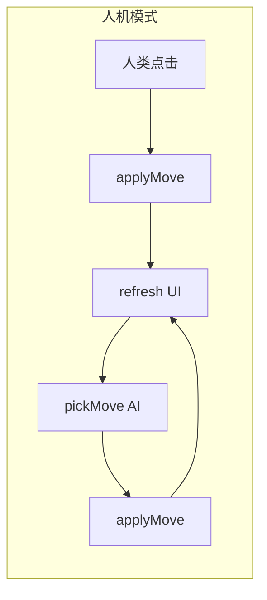

# 人机对战模块实现规划

## 现状与接入点

- 引擎：[src/game/gomoku.ts](../src/game/gomoku.ts) 已提供 `GomokuGame`、`applyMove`、`toSnapshot`、`newGame`、`undoLastMove` 等；AI 只需读快照或游戏状态、输出合法坐标 `(x, y)`。
- 本地 UI：[src/main.ts](../src/main.ts) 中 `mountLocal` 负责计时、终局/超时弹层、棋盘与 `board.setOnMove` → `applyMove` → `refresh`。
- 联网 UI：[src/ui/onlineMode.ts](../src/ui/onlineMode.ts) 与 [server/index.ts](../server/index.ts) 无关人机；人机可完全在前端闭环。
- 棋盘：[src/ui/boardView.ts](../src/ui/boardView.ts) 无模式概念，人机模式可直接复用 `createBoardView`。

## 1. 产品与交互（需先定规则）

- **执子**：常见为「玩家执黑先手 / 执白后手」二选一（开局前选择，或固定一种 MVP）。
- **难度**（可选）：如「简单 / 普通」对应不同搜索深度或是否启用杀棋逻辑；MVP 可先单一难度。
- **计时**：与本地 60s/15s 是否一致——通常仅对人类计时，AI 瞬时落子可不占计时器；或人机 Tab 下关闭计时。
- **悔棋**：建议「一步悔棋」撤销人类上一手，若上一手之后 AI 已应子，则一次悔棋撤销两手（人类+AI），保持棋盘一致；需在 UI 上与本地双人行为对齐说明。
- **终局**：与现有一致：胜负/超时弹层 +「重新开始」；超时仅针对人类方即可。

以上若未在首版实现，也应在规划里写明「首版范围」避免与本地逻辑强行复用出错。

## 2. AI 算法模块（核心开发量）

建议新建目录 **`src/game/ai/`**（或 `src/ai/`），与引擎同语言、可单测：

| 层次 | 思路 | 工作量 | 说明 |
| --- | --- | --- | --- |
| MVP | 基于空位打分：连五/活四/冲四/活三等模式 + 防守对方威胁 | 中 | 15×15 全盘点可接受；易测、无深度爆炸 |
| 增强 | 极小化极大 + α-β + 候选点裁剪（仅靠近已有子） | 大 | 强度更好，需调深度与超时 |
| 可选 | 开局库、禁手（若规则要求） | 视规则 | 当前引擎为「五连即胜」，与竞技五子棋禁手规则不同，需与产品一致 |

对外接口可统一为：

- `pickMove(game: GomokuGame, aiPlayer: Player): { x: number; y: number } | null`
  - 内部仅用 `game.board`、`game.currentPlayer === aiPlayer` 时调用；返回任一合法空位；若无（和棋）返回 `null`。

**测试**：[src/game/gomoku.test.ts](../src/game/gomoku.test.ts) 旁增加 `ai.test.ts`：指定盘面时 AI 应优先堵四连、或完成四连；随机局面下 `applyMove` 始终 `ok`。

## 3. UI 与入口

- **[src/main.ts](../src/main.ts)**：`mode-tabs` 增加第三个 tab（如「人机对战」），`aria-labelledby` / `showPvE` 与 `showLocal` / `showOnline` 并列；`panelHost` 内挂载新函数 `mountPvE(panelHost)`。
- **布局**：可复用本地栏目的结构（状态行、棋盘、侧栏「重新开始」「悔棋」），减少重复；若重复代码过多，再抽 **`mountLocalLikeBoard`** 共享 DOM 与 refresh 模式（第二迭代即可）。
- **开局控件**：在棋盘上方增加「我执黑 / 我执白」或单选；点「重新开始」时重置为所选执子 + `newGame`。
- **AI 回合**：在 `refresh` 或人类 `applyMove` 成功后，若 `snap.status === 'playing'` 且 `snap.currentPlayer === aiPlayer`，则：
  - `setInteractive(false)`；
  - 使用 `queueMicrotask` / `requestAnimationFrame` / 短 `setTimeout`（可选「思考中」提示）调用 `pickMove` → `applyMove` → `refresh`；
  - 再恢复人类可点。注意避免与本地计时器 interval 竞态（可参考 `mountLocal` 里 `ensureTurnTimer` 仅在人类回合计时）。

## 4. 与现有逻辑的边界

- **不修改** `server/index.ts`、WebSocket 消息格式。
- **可选** 从 [src/game/index.ts](../src/game/index.ts) 导出 AI 相关类型/函数供测试；不必把 AI 放进联网链路。
- **副标题**：可将 [index.html](../index.html) / `sub.textContent` 更新为包含「人机」一句（文案小改）。

## 5. 建议实施顺序

1. 实现 `pickMove` + 单元测试（无 UI）。
2. 实现 `mountPvE`：无计时、无超时弹层，仅人类 vs AI 轮流与胜负展示（可先用最简 `alert` 或复用现有 end 弹层组件若已抽象）。
3. 接入 tab、执子选择、悔棋（两手）策略。
4. 对齐本地体验：计时、超时、与本地一致的 `board-local-dialog` 文案（若复用组件）。
5. 调难度或搜索深度（若需要）。

## 6. 风险与注意点

- **性能**：全棋盘 minimax 无裁剪易卡死；MVP 优先启发式打分更稳妥。
- **公平性**：先手无禁手时黑棋略优，可通过「玩家固定执白」或 AI 略强平衡。
- **无障碍**：AI 落子后 `aria-live` 与「最后落子」高亮已由 `boardView` 更新，一般足够。
