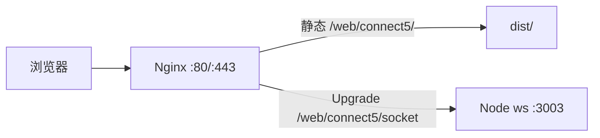

# connect5 腾讯云服务器部署方案

项目根目录为 **`connect5/`**（不是 connet5）。技术栈：**Vite 前端** + **Node + ws 的独立服务**（[`server/index.ts`](../server/index.ts)），WebSocket 路径为 **`/socket`**，默认端口 **`PORT` 环境变量或 3003**。

```typescript
// server/index.ts（约第 35 行）
const PORT = Number(process.env.PORT) || 3003
```

前端站点路径为 **`/web/connect5/`**（Vite `base`）。生产环境 WebSocket 逻辑见 [`src/net/wsUrl.ts`](../src/net/wsUrl.ts)：未设置 `VITE_WS_URL` 时，会连到与页面同源的 **`/web/connect5/socket`**（需 Nginx 反代到本机 3003）。若仍直连 3003，可设 `VITE_WS_URL` 覆盖。

2 核 4G / 70G 磁盘对该游戏完全够用。

---

## 架构示意（推荐：Nginx 反代）



---

## 1. 服务器基础环境

- 系统建议：**Ubuntu 22.04 LTS**（或你镜像自带的 Debian/Ubuntu；CentOS 亦可，包名略有不同）。
- 安装 **Node.js 20 LTS**（[NodeSource](https://github.com/nodesource/distributions) 或 nvm；需满足 Vite 8 / TypeScript 5.9）。
- 安装 **Nginx**（提供静态资源与反向代理）。

---

## 2. 代码上机方式

任选其一：

- **Git**：在服务器 `git clone`，`cd connect5`。
- **本机打包上传**：`scp`/`rsync` 整个目录（生产环境不必上传 `node_modules`，在服务器执行 `npm ci`）。

也可使用仓库内脚本：[`deploy/rsync-from-dev.sh`](../deploy/rsync-from-dev.sh)。

---

## 3. 依赖与构建

在项目根目录：

```bash
npm ci
npm run build
```

或使用（含推荐的生产 WebSocket 地址参数）：[`deploy/build-production.sh`](../deploy/build-production.sh)。

- 产物：[`dist/`](../dist)（由 `vite build` 生成）。
- 说明：当前 [`package.json`](../package.json) 里 **`server` 脚本依赖 `tsx`（devDependency）**。最简单做法是 **`npm ci` 安装全部依赖**（含 dev）再跑服务；若日后想 `npm ci --omit=dev`，需要单独增加「把 server 编译成 JS」的步骤。

---

## 4. WebSocket 地址（必看）

| 方式 | 做法 |
| ---------------------------- | --------------------------------------------------------------------------------------------------------------------------------------------------------------------------------------------- |
| **A. 放行 3003** | 腾讯云安全组入站放行 **TCP 3003**；页面用 **http://服务器IP** 打开时，前端会连 **`ws://IP:3003/socket`**（与 [`wsUrl.ts`](../src/net/wsUrl.ts) 一致）。HTTPS 站点若仍直连 3003，需 **wss + 3003 证书**，一般不推荐。 |
| **B. 推荐：Nginx 反代** | 只放行 **80/443**；Nginx 把 **`/web/connect5/socket`** 转到后端 **`http://127.0.0.1:3003/socket`**（见 [`deploy/nginx-connect5.conf`](../deploy/nginx-connect5.conf)）。一般 **无需** `VITE_WS_URL`；若前端与 WS 不同源再设，例如 `VITE_WS_URL=wss://你的域名/web/connect5/socket`。 |

开发时 Vite 已通过 [`vite.config.ts`](../vite.config.ts) 把 **`/socket`** 代理到 3003（开发服务器仍用根路径 `/socket`）；**生产**由 Nginx 处理子路径。

---

## 5. 常驻运行 WebSocket 服务（systemd）

示例单元文件见 [`deploy/connect5-ws.service`](../deploy/connect5-ws.service)；一键安装见 [`deploy/install-server.sh`](../deploy/install-server.sh)。

要点：

- `WorkingDirectory`：指向服务器上的 `connect5` 目录。
- `ExecStart`：`/usr/bin/npm run server`（或 `npx tsx server/index.ts`）。
- `Environment=PORT=3003`（或你想要的端口，与 Nginx `proxy_pass` 一致）。
- `Restart=always`。

然后：`systemctl daemon-reload && systemctl enable --now connect5-ws`。

（可选：用 **PM2** 代替 systemd，思路相同。）

---

## 6. Nginx 配置要点

模板见 [`deploy/nginx-connect5.conf`](../deploy/nginx-connect5.conf)（站点 **`/web/connect5/`**，可选根路径 **`/` → 302 → `/web/connect5/`**）。

- 静态：`location /web/connect5/` + **`alias .../dist/`** + **`try_files`** 回退到 **`/web/connect5/index.html`**。
- **WebSocket**：对外路径 **`/web/connect5/socket`**，`rewrite` 为后端 **`/socket`**（与 [`server/index.ts`](../server/index.ts) 中 `path: '/socket'` 一致）：

```nginx
location /web/connect5/socket {
  rewrite ^/web/connect5/socket$ /socket break;
  proxy_pass http://127.0.0.1:3003;
  proxy_http_version 1.1;
  proxy_set_header Upgrade $http_upgrade;
  proxy_set_header Connection "upgrade";
  proxy_set_header Host $host;
}
```

- 修改配置后：`nginx -t && systemctl reload nginx`。

---

## 7. 腾讯云安全组与防火墙

- **安全组**：至少放行 **22**（SSH）、**80**（HTTP）；若上 HTTPS 再放行 **443**。
- 若采用方式 **A**（直连 3003）：再放行 **3003**。
- 若系统启用了 **ufw/firewalld**，规则与安全组保持一致。

首次装机可参考 [`deploy/bootstrap-server.sh`](../deploy/bootstrap-server.sh)（内含安全组说明注释）。

---

## 8. HTTPS（可选但建议有域名时做）

- 域名 **A 记录** 指向服务器公网 IP。
- **Certbot** 申请 Let’s Encrypt 证书，Nginx 插件自动改配置。
- 一般同源即可；若需手写完整地址，使用 **`VITE_WS_URL=wss://你的域名/web/connect5/socket`**，避免混合内容（HTTPS 页不能连 `ws://`）。

---

## 9. 验证清单

- `systemctl status connect5-ws` 为 active。
- `curl -I http://127.0.0.1/web/connect5/` 返回 200；`curl -I http://127.0.0.1/` 若为 302 到 `/web/connect5/` 属正常。
- 浏览器联机模式：建房/加入无报错（开发者工具 Network → WS 应连到预期 URL）。

---

## 小结

- **最小步骤**：装 Node + Nginx → 上传项目 → `npm ci && npm run build` → systemd 跑 **`npm run server`** → Nginx 配置 **`/web/connect5/`** 与反代 → 安全组放行 **80**；若不用 Nginx 反代 WebSocket，再放行 **3003**。
- **更干净的生产方式**：Nginx 反代 **`/web/connect5/socket`**，前端默认同源连 WS，对外只暴露 **80/443**。
